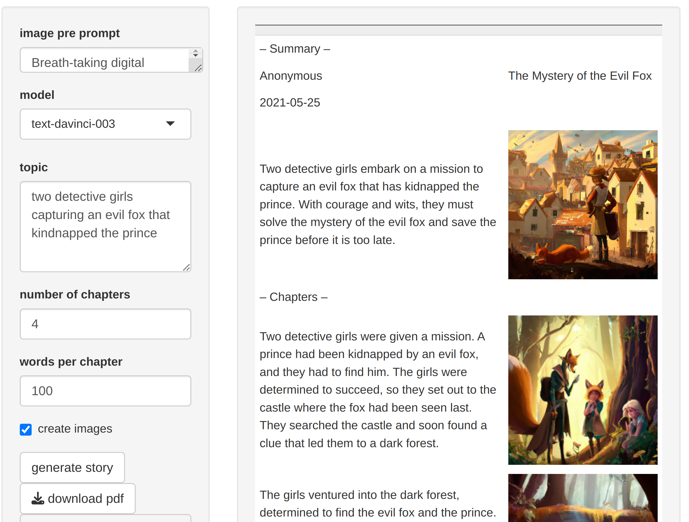
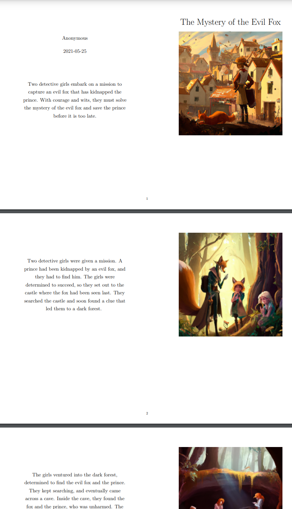

# story_generator
Generate story for kids using some keywords, chapters with images, pdf generation

# Dependencies

 - [An OpenAI API Key](https://elephas.app/blog/how-to-create-openai-api-keys-cl5c4f21d281431po7k8fgyol0)


# Usage

Run the shiny app:

```
# start shiny app (from within the shinyapp folder)
R -e "shiny::runApp()
```

Use the functions:

```r
source("global.r")

# generate story
story = get_story(
    OPENAI_API_KEY = Sys.getenv("OAI_API_KEY"),
    model_in = "text-davinci-003",
    chapters = 4,
    words_per_chapter = 50,
    date = lubridate::today(),
    topic = "robbery in candyshop, detectives solve case",
    prompt = NULL,
)

out_folder = tempdir()

# create images and pdf
out = compile_story(
    story,
    create_images = TRUE,
    create_pdf = TRUE,
    folder = out_folder
)

# object out contain tex and markdown strings,
# as well as file locations
system(paste("open", out$pdf))
``` 

# Screenshots 



